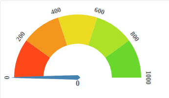

# react-d3-speedometer

**react-d3-speedometer** is a react component for showing speedometer like gauge using d3.

[](https://travis-ci.org/palerdot/react-d3-speedometer)

[](https://npmjs.org/package/react-d3-speedometer)



## Usage:

**NPM:**
`npm install --save react-d3-speedometer` 

**Yarn:**
`yarn add react-d3-speedometer` 

```javascript
// import the component
import ReactSpeedometer from "react-d3-speedometer";
// and just use it
<ReactSpeedometer />
```

## Configuration Options:

| prop        | type           | default  | comments |
| ------------|:--------------:| --------:| ---------|
| value       | number         | 0        |   Make sure your value is between your `minValue` and `maxValue`       |
| minValue    | number         | 0        |          |
| maxValue    | number         | 1000     |          |
| segments    | number         | 5        | Number of segments in the speedometer         |
| forceRender | boolean        | false    | After initial rendering/mounting, when props change, only the `value` is changed and animated to maintain smooth visualization. But, if you want to force rerender the whole component like change in segments, colors, dimensions etc, you can use this option to force rerender of the whole component on props change.         |
| width       | number         | 300      | **diameter** of the speedometer and the **width** of the svg element |
| height      | number         | 300      | height of the svg element. Height of the speedometer is always half the width since it is a **semi-circle**. For fluid width, please refere to `fluidWidth` config |
| fluidWidth  | boolean        | false    | If `true` takes the width of the parent component. See [Live Example](http://palerdot.in/react-d3-speedometer/?selectedKind=React%20d3%20Speedometer&selectedStory=Fluid%20Width%20view&full=0&down=0&left=1&panelRight=0&downPanel=kadirahq%2Fstorybook-addon-actions%2Factions-panel) for more details |
| needleColor | string         | steelblue | Should be a valid color code - colorname, hexadecimal name or rgb value. Should be a valid input for [d3.interpolateHsl](https://github.com/d3/d3-interpolate#interpolateHsl)   |
| startColor | string         | #FF471A | Should be a valid color code - colorname, hexadecimal name or rgb value. Should be a valid input for [d3.interpolateHsl](https://github.com/d3/d3-interpolate#interpolateHsl)   |
| endColor | string         |  #33CC33 | Should be a valid color code - colorname, hexadecimal name or rgb value. Should be a valid input for [d3.interpolateHsl](https://github.com/d3/d3-interpolate#interpolateHsl)   |
| needleTransition | string         | easeQuadInOut | [d3-easing-identifiers](https://github.com/d3/d3-ease) - easeLinear, easeQuadIn, easeQuadOut, easeQuadInOut, easeCubicIn, easeCubicOut, easeCubicInOut, easePolyIn, easePolyOut, easePolyInOut, easeSinIn, easeSinOut, easeSinInOut, easeExpIn, easeExpOut, easeExpInOut, easeCircleIn, easeCircleOut, easeCircleInOut, easeBounceIn, easeBounceOut, easeBounceInOut, easeBackIn, easeBackOut, easeBackInOut, easeElasticIn, easeElasticOut, easeElasticInOut, easeElastic |
| needleTransitionDuration | number         | 500     | Time in milliseconds. |
| ringWidth | number         | 60     | Width of the speedometer ring. |
| textColor | string         | #666     | Should be a valid color code - colorname, hexadecimal name or rgb value. Used for both showing the current value and the segment values |
| valueFormat | string       |  | should be a valid format for [d3-format](https://github.com/d3/d3-format#locale_format). By default, no formatter is used. You can use a valid d3 format identifier (for eg: `d` to convert float to integers), to format the values. **Note:** This formatter affects all the values (current value, segment values) displayed in the speedometer |
| currentValueText | string | ${value} | Should be provided a string which should have **${value}** placeholder which will be replaced with current value. By default, current value is shown (formatted with `valueFormat`). For example, if current Value is 333 if you would like to show `Current Value: 333`, you should provide a string **`Current Value: ${value}`**. See [Live Example](http://palerdot.in/react-d3-speedometer/?selectedKind=react-d3-speedometer&selectedStory=Custom%20Current%20Value%20Text&full=0&down=1&left=1&panelRight=0) |

## Examples

You can view [Live Examples here](http://palerdot.in/react-d3-speedometer/?selectedKind=React%20d3%20Speedometer&selectedStory=Default%20with%20no%20config&full=0&down=0&left=1&panelRight=0&downPanel=kadirahq%2Fstorybook-addon-actions%2Factions-panel)

##### Default with no config - [Live Example](http://palerdot.in/react-d3-speedometer/?selectedKind=React%20d3%20Speedometer&selectedStory=Default%20with%20no%20config&full=0&down=0&left=1&panelRight=0&downPanel=kadirahq%2Fstorybook-addon-actions%2Factions-panel)

```javascript
<ReactSpeedometer />
```

##### With configurations - [Live Example](http://palerdot.in/react-d3-speedometer/?selectedKind=React%20d3%20Speedometer&selectedStory=Configuring%20values&full=0&down=0&left=1&panelRight=0&downPanel=kadirahq%2Fstorybook-addon-actions%2Factions-panel)

```javascript
<ReactSpeedometer
    maxValue={500}
    value={473}
    needleColor="red"
    startColor="green"
    segments={10}
    endColor="blue"
/>
```

##### Fluid Width Example - [Live Example](http://palerdot.in/react-d3-speedometer/?selectedKind=React%20d3%20Speedometer&selectedStory=Fluid%20Width%20view&full=0&down=0&left=1&panelRight=0&downPanel=kadirahq%2Fstorybook-addon-actions%2Factions-panel)

```javascript
// Speedometer will take the width of the parent div (500)
// any width passed will be ignored
<div style={{
    width: "500px",
    height: "300px",
    background: "#EFEFEF"
}}>
    <ReactSpeedometer
        fluidWidth={true}
        minValue={100}
        maxValue={500}
        value={473}
        needleColor="steelblue"
    />
</div>
```

##### Needle Transition Example - [Live Example](http://palerdot.in/react-d3-speedometer/?selectedKind=React%20d3%20Speedometer&selectedStory=Needle%20Transition%20Duration&full=0&down=0&left=1&panelRight=0&downPanel=kadirahq%2Fstorybook-addon-actions%2Factions-panel)

```javascript
<ReactSpeedometer
    value={333}
    needleColor="steelblue"
    needleTransitionDuration={4000}
    needleTransition="easeElastic"
/>
```

_This is the needle transition used in the sample image_

##### Force Render component on props change - [Live Example](http://palerdot.in/react-d3-speedometer/?selectedKind=react-d3-speedometer&selectedStory=force%20render%20the%20component&full=0&down=1&left=1&panelRight=0)

```javascript
// By default, when props change, only the value prop is updated and animated. 
// This is to maintain smooth visualization and to ignore breaking appearance changes like segments, colors etc. 
// You can override this behaviour by giving forceRender: true

// render a component initially
<ReactSpeedometer
  width={200}
  height={200}
/>
// Now, if given forceRender: true, and change the appearance all together, the component will rerender completely on props change
<ReactSpeedometer
  forceRender={true}
  segments={15}
  width={500}
  height={500}
/>
```


---

### Todos:

- [x] Test coverage (with enzyme)
- [ ] Convert entire code base to ES6

---

### Tests:

`react-d3-speedometer` comes with a test suite using [enzyme](https://github.com/airbnb/enzyme).

```javascript
// navigate to root folder and run
npm test
// or 'yarn test' if you are using yarn
```

---

#### Changelog:

[View Changelog](CHANGELOG.md)

---

#### Credits:
`react-d3-speedometer` was started as a react port of the following d3 snippet - [http://bl.ocks.org/msqr/3202712](http://bl.ocks.org/msqr/3202712). Component template bootstrapped with [React CDK](https://github.com/storybooks/react-cdk). Also, many thanks to `d3` and `react` ecosystem contributors.

---

#### License:

[MIT](LICENSE)
